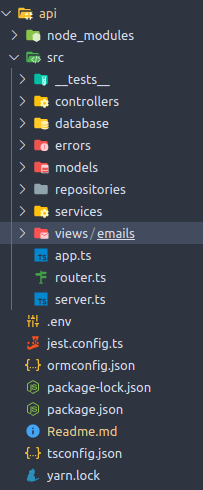
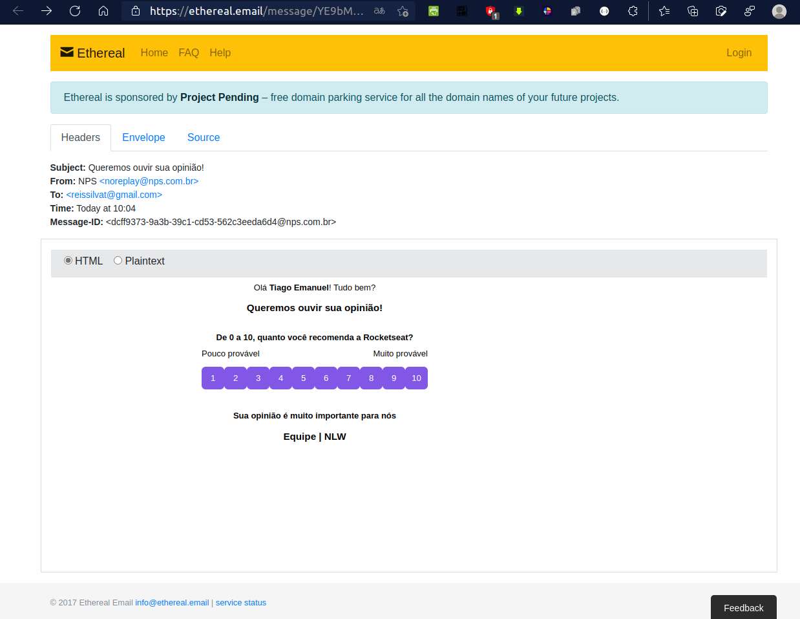

# **Projeto envio de e-mail !**

Projeto desenvolvido na quarta edição da NLW4 Rockeseat! :rocket:

O projeto consiste em uma API que envia e-mails com pesquisa de satifação para os usuários cadastrados, banco de dados utilizado Sqlite3.

:point_right: **NodeJs**

:point_right: **TypeScript**

:point_right: **TypeOrm**

---

Organização:

## 

---

Resultado fina:

